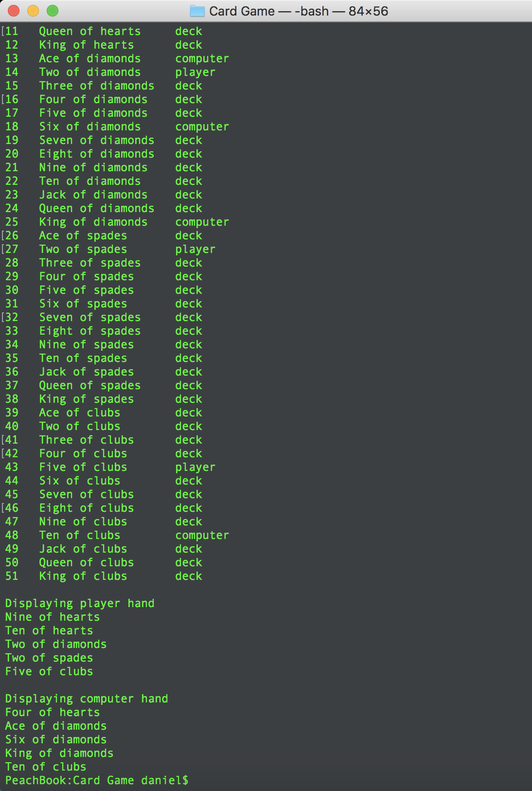
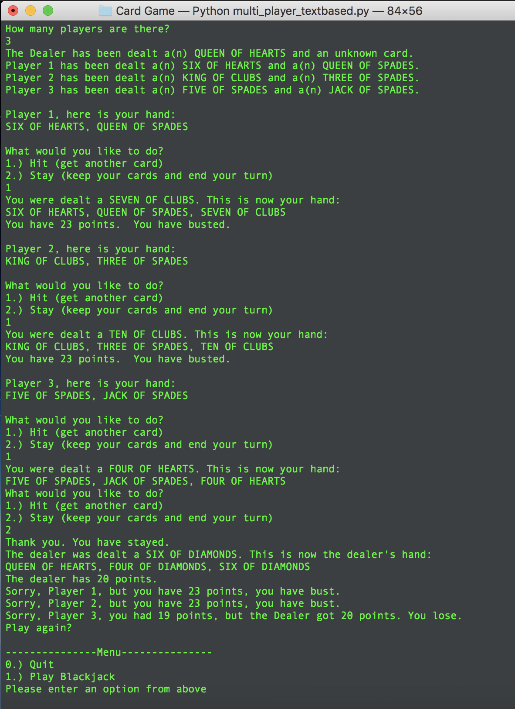

# 06 - Card Game (Arrays & GUI)

## What we were instructed to do:

> The objective of this lab is to create the beginnings for a python-based card game. We DO NOT expect a fully functioning card game. What we do expect is that you create a main function and various functions that will accomplish the following goals:
> * Build a single-dimension array to keep track of the location of every card
> * DO NOT move cards around... Just use the array to keep track of where each card is
> * All card data is really integers - Use other arrays to translate integers to suits, ranks, and player names
> * All cards will start in the DECK
> * Write a function that translates a card number to a card name. HINT - look at the suitName and rankName arrays
> * Write a function to assign a card to a given player
> * Dealing a card involves picking a card number and assigning a new location to the corresponding element of cardLoc
> * Write a function that displays the location of every card. (Early versions should show numeric values for the card number and location. Later versions can include string values for prettier output.)
> * Write a function that prints the name of every card in a given hand

## What I did:

> This was the first GUI program I created, and I used TKinter. I created a fully-functioning **Blackjack GUI** (no betting). I also created single-player and multi-player text-based versions.

NOTE:
> This is tested on a Mac, and **SHOULD** work on Windows, but it is not certain.

## How to run this project

* Begin by cloning or downloading the entire *CS_230* repository from GitHub.
* Make sure you have Python 3 installed.
    * Open Command Prompt on Windows or Terminal on Mac.
    * Type `python --version` and press **Enter**.
    * > Depending how you have Python installed, you may have to run `python3 --version` to see your Python 3 version number.
    * If you see a version starting with 3.6.x, you have a suitable version installed. 
    * If you do not, install the latest version here: [Download Python 3](https://www.python.org/downloads/)
* Open the *CS_230* folder on your machine, find the *06 - Card Game (Arrays & GUI)* folder, and open it in Command Prompt on Windows and Terminal on Mac.
* Type `python card_game_basic.py` and press **Enter** to run the basic assignemnt
    > This just uses a single dimensional array to hold all card locations, the values and suits are added as they print out, and never actually stored in memory with the particular card.
* Type `python single_player_textbased.py` or `python multi_player_textbased.py` to run the text-based game versions. 
    > These are text based games that allows a single or multiple players to play blackjack against the computer. (in order to skip all the instructions, enter `2` at the main menu)
* Type `python single_player_gui.py` to run the GUI version of the game. 
    > This is a GUI built using TKinter that allows a single player to play blackjack against the computer.

## Summary 
This assignment was also not very eventful, but allowed me a chance to move on to the next assignment early and create several versions of it, each one being more complicated and awesome than the last. I highly reccommend checking out that next assignment, Card Game. (Especially the **GUI** version!)

# Card Game - First GUI Program (TKinter)

This was a series of card games written in various ways.  

The first one uses a single dimensional array to hold all deck info as card location. (This was the homework asignment)

The second and third are Black Jack Games, text based. The first of these is single player and the second is multi player (up to 4 or 5 I believe.) 

The last one was my first attempt doing a GUI with python.  I used TKinter to make a old fashioned looking card game interface, and I had a lot of fun doing it.

### To run the app:
> Prerequisites
> * Python3
  
* Once you have python3 installed, clone the repo.
* `cd` into the repo, and then the Card Game directory.
* To run the basic homework assignment: `python3 card_game_basic.py`

This just uses a single dimensional array to hold all card locations, the values and suits are added as they print out, and never actually stored in memory with the particular card.
* To run the single player text-based game: `python3 single_player_textbased.py`

This is a text based game that allows one player to play blackjack against the computer. (in order to skip all the instructions, enter `2` at the main menu)
* To run the multiple player text-based game: `python3 multi_player_textbased.py`

This is a text based game that allows multiple players to play blackjack against the computer. (in order to skip all the instructions, enter `2` at the main menu)
* To run the single player GUI game: `python3 single_player_gui.py`

This is a GUI built using TKinter that allows a single player to play blackjack against the computer.
