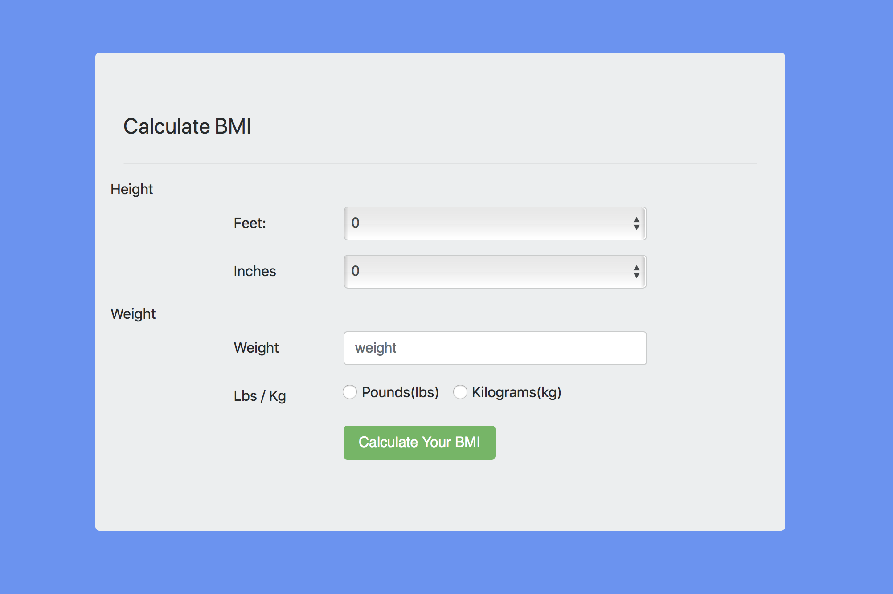

# BMI - First Bottle.py Web App

This was my first web app built in python, I used Bottle.py, and all it does is take in the size of a user and give them their bmi.

### To run the app:
> Prerequisites:
  * Python3
  
* Once you have python3 downloaded, clone the repo.
* `cd` into the repo, and then the BMI directory.
* run `python3 app.py`
* Open your browser and go to http://localhost:8080/

This is the home page, where you can enter your size and weight, in kg or lbs.

Both fields are required, and do basic error checking.

* click submit

This is the result page, which tells you your BMI, as well as whether you classify as 'underweight', 'normal', 'overweight', or 'obese'.
