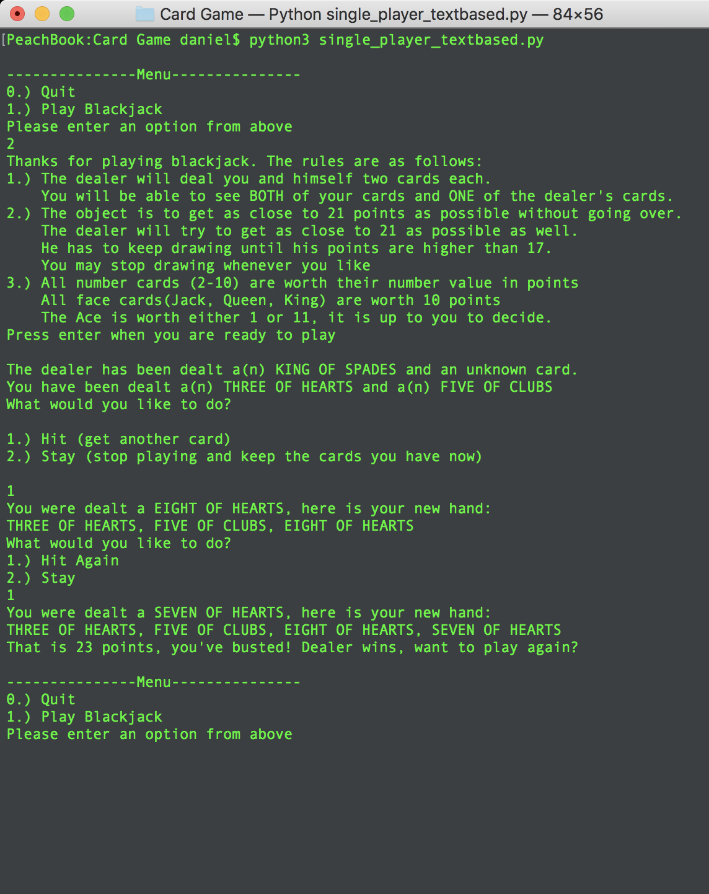
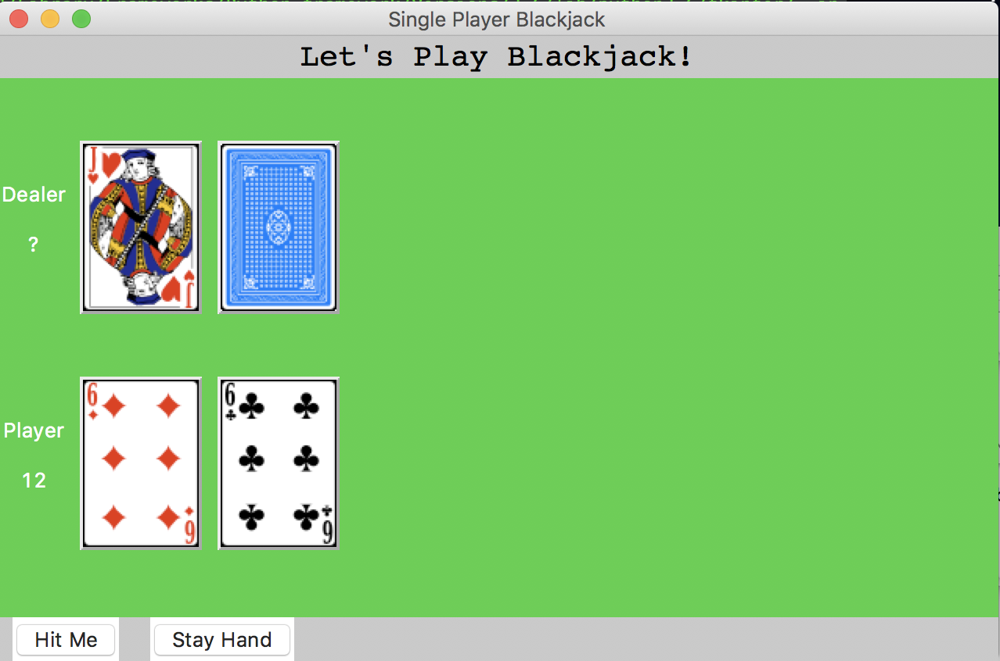

# Card Game - First GUI Program (TKinter)

This was a series of card games written in various ways.  

The first one uses a single dimensional array to hold all deck info as card location. (This was the homework asignment)

The second and third are Black Jack Games, text based. The first of these is single player and the second is multi player (up to 4 or 5 I believe.) 

The last one was my first attempt doing a GUI with python.  I used TKinter to make a old fashioned looking card game interface, and I had a lot of fun doing it.

### To run the app:
> Prerequisites
  * Python3
  
 * Once you have python3 installed, clone the repo.
 * `cd` into the repo, and then the Card Game directory.
 * To run the basic homework assignment: `python3 card_game_basic.py`
 
 This just uses a single dimensional array to hold all card locations, the values and suits are added as they print out, and never actually stored in memory with the particular card.
 * To run the single player text-based game: `python3 single_player_textbased.py`
 
 This is a text based game that allows one player to play blackjack against the computer. (in order to skip all the instructions, enter `2` at the main menu)
 * To run the multiple player text-based game: `python3 multi_player_textbased.py`
 
 This is a text based game that allows multiple players to play blackjack against the computer. (in order to skip all the instructions, enter `2` at the main menu)
 * To run the single player GUI game: `python3 single_player_gui.py`
 
 This is a GUI built using TKinter that allows a single player to play blackjack against the computer.
